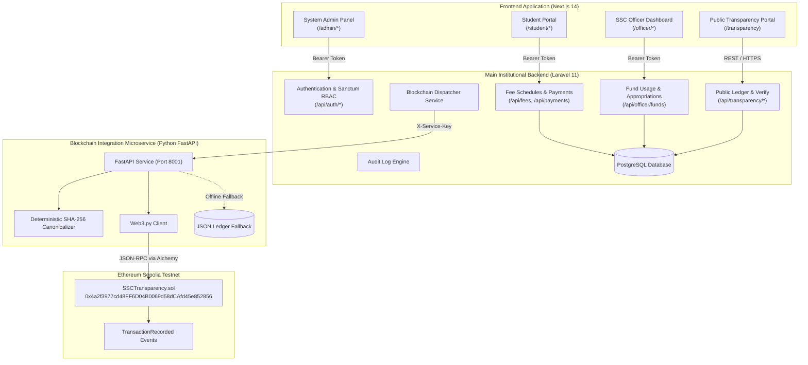
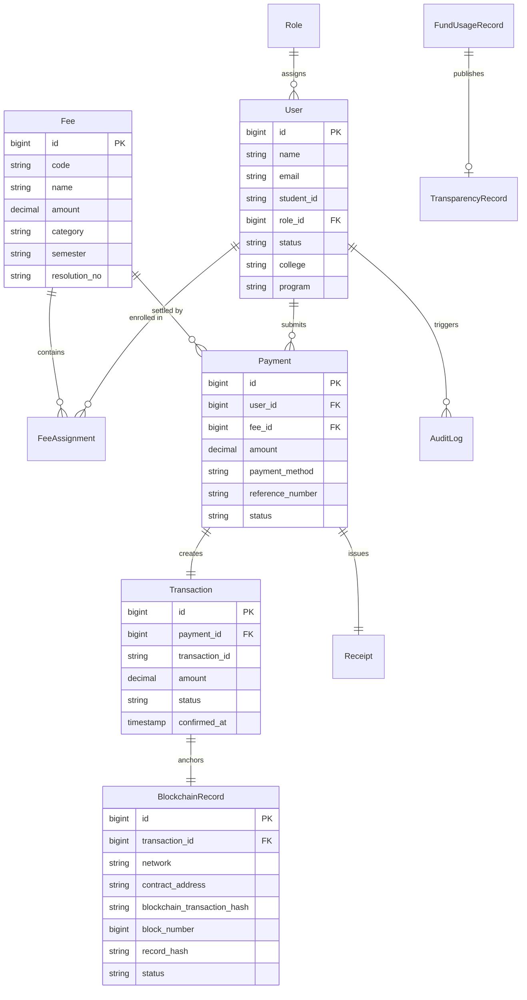

# Supreme Student Council (SSC) Financial Transparency & Blockchain Verification System
## Comprehensive Technical Documentation & User Manual

---

## 1. System Overview & Architecture

The **Supreme Student Council (SSC) Financial Transparency System** is an enterprise-grade, decentralized-audited financial management platform engineered for institutional governance, automated fee collections, transparent council disbursements, and tamper-evident blockchain verification.

### High-Level Architecture Diagram



---

## 2. Frontend Application (`web/`)

Built with **Next.js 14 (App Router)**, **React 18**, **TypeScript**, and **Tailwind CSS**, themed with institutional colors (**Maroon `#800020`** and crisp white), featuring accessible UI primitives via Radix and Lucide Icons.

### Directory Structure
```text
web/
├── public/                     # Static assets (ssc-logo.png, icons)
├── src/
│   ├── app/                    # Next.js App Router routes
│   │   ├── page.tsx            # Landing page
│   │   ├── transparency/       # Public Transparency Portal
│   │   ├── login/              # Unified login page
│   │   ├── student/            # Student portal routes
│   │   │   ├── dashboard/      # Student overview & dues
│   │   │   ├── fees/           # Mandatory fee breakdown
│   │   │   ├── payment/        # Payment submission form
│   │   │   ├── receipt/[id]/   # Official digital receipt
│   │   │   └── transactions/   # Payment ledger & tx detail
│   │   └── officer/            # Officer portal routes
│   │       ├── dashboard/      # Executive KPIs & stats
│   │       ├── fees/           # Fee creation & schedules
│   │       ├── funds/          # Fund usage & disbursement
│   │       ├── reports/        # Financial audit reports
│   │       └── transactions/   # Payment validation & review
│   ├── components/             # Reusable UI component library
│   │   ├── layout/             # AppShell, Navbar, Sidebar
│   │   ├── shared/             # VerificationBadge, StatCard, PublicPortal
│   │   └── ui/                 # Button, Card, Dialog, Table, Toast
│   └── lib/                    # API clients, auth helpers, types
```

### Key Frontend Features
1. **Zero-Knowledge Public Transparency Portal (`/transparency`)**:
   - Live council balance, collections vs. disbursements summary cards.
   - Interactive verification engine supporting search by receipt number (`SSC-RCP-...`), transaction reference (`SSC-2026-...`), appropriation resolution, or SHA-256 hash.
   - Tabular view of all collections and disbursements with direct links to Sepolia Etherscan.
2. **Student Portal (`/student/*`)**:
   - Assessment fee cards with status indicators (Paid, Pending, Overdue).
   - Receipt modal featuring print-ready formatting and tamper-evident SHA-256 payload digest.
3. **SSC Officer Portal (`/officer/*`)**:
   - Real-time KPI statistics: Total Collections, Total Budget, Balance, Pending Verification queue.
   - Fund usage disbursement entry with automatic cryptographic hash computation and blockchain dispatching.
   - Payment verification panel for reviewing student proof-of-payment receipts.

### Environment Configuration (`web/.env.local`)
```env
NEXT_PUBLIC_API_URL=https://bountiful-harmony-production-de11.up.railway.app/api
NEXT_PUBLIC_BLOCKCHAIN_NETWORK=sepolia
NEXT_PUBLIC_CONTRACT_ADDRESS=0x4a2f3977cd48FF6D04B0069d58dCAfd45e852856
NEXT_PUBLIC_EXPLORER_URL=https://sepolia.etherscan.io
```

---

## 3. Main Backend (`backend/`)

Built on **Laravel 11** with **PHP 8.2+**, **PostgreSQL**, and **Laravel Sanctum** token-based authentication.

### Core Architectural Concepts
- **Strict Role-Based Access Control (RBAC)**: Managed via middleware `role:student`, `role:officer`, `role:admin`.
- **Zero PII Leakage onto Blockchain**: The `BlockchainService` generates deterministic canonical hashes using student reference salts; names, raw student numbers, and contact information are strictly preserved in the private relational database.
- **Automated Database Seeder & Health API**: Built-in self-healing and auto-seeding logic ensures demo accounts and fee mandates are immediately initialized.

### Database Models & Schema Relationships



### Complete API Reference

#### 1. Authentication (`/api/auth/*`)
| Method | Endpoint | Description | Auth Required |
| :--- | :--- | :--- | :--- |
| `POST` | `/api/auth/login` | Authenticate institutional account; returns Sanctum bearer token | None |
| `GET` | `/api/auth/me` | Fetch authenticated user profile & role permissions | Sanctum |
| `POST` | `/api/auth/logout` | Revoke active access token | Sanctum |

#### 2. Public Transparency (`/api/transparency/*`)
| Method | Endpoint | Description | Parameters |
| :--- | :--- | :--- | :--- |
| `GET` | `/api/transparency/summary` | Financial KPIs (collections, disbursements, balance) | None |
| `GET` | `/api/transparency/collections` | Fee collection aggregates by semester & department | None |
| `GET` | `/api/transparency/funds` | Published council fund expenditures | None |
| `GET` | `/api/transparency/ledger` | Public blockchain attestation ledger (last 50 records) | None |
| `GET/POST` | `/api/transparency/verify` | Verify any receipt, transaction ID, hash, or resolution | `?query=...` or `?q=...` |

#### 3. Student Services (`/api/student/*`)
| Method | Endpoint | Description | Role |
| :--- | :--- | :--- | :--- |
| `GET` | `/api/student/fees` | List student's enrolled fee obligations | Student |
| `GET` | `/api/student/payments` | Payment submission history | Student |
| `POST` | `/api/student/payments` | Submit new payment with proof slip | Student |
| `GET` | `/api/student/receipts/{id}` | Official receipt details with SHA-256 digest | Student |

#### 4. Officer & Admin Services (`/api/officer/*`, `/api/admin/*`)
| Method | Endpoint | Description | Role |
| :--- | :--- | :--- | :--- |
| `GET` | `/api/officer/payments` | Pending payment verification queue | Officer / Admin |
| `POST` | `/api/officer/payments/{id}/verify` | Approve payment, issue receipt, trigger blockchain anchoring | Officer / Admin |
| `POST` | `/api/officer/funds` | Record and publish new council expenditure | Officer / Admin |
| `GET` | `/api/admin/audit-logs` | Immutable system event and security log | Admin |
| `GET` | `/api/admin/users` | Manage registered accounts and permissions | Admin |

---

## 4. Blockchain Microservice (`blockchain-api/`)

A dedicated asynchronous **FastAPI** service written in **Python 3.12** bridging the relational backend with the Ethereum blockchain via **Web3.py**.

### Key Responsibilities
1. **Canonical Payload Hashing**: Deterministically normalizes fee metadata, centavo integer amounts, and timestamps into canonical JSON before hashing via `hashlib.sha256()`.
2. **Smart Contract Transaction Relayer**: Uses a secure gas-funded private key to invoke `recordTransaction(bytes32 txKey, bytes32 recordHash, uint256 amount, uint256 timestamp)` on Sepolia.
3. **Resilient Local Fallback**: If Ethereum RPC connectivity is interrupted, the service safely records attestations into `data/local_chain_ledger.json` to prevent application downtime, while retaining transactions for on-chain replay.

### Endpoints
- `GET /health`: Health status and RPC connection state.
- `GET /api/blockchain/network`: Returns active chain ID (`11155111`), block height, and contract address.
- `POST /api/blockchain/transactions`: Submits a record hash to the smart contract. Requires header `X-Service-Key`.
- `POST /api/blockchain/verify`: Verifies a given transaction ID and hash against on-chain contract state.

---

## 5. Smart Contracts (`contracts/`)

The core transparency logic is enforced by **`SSCTransparency.sol`**, written in **Solidity `^0.8.24`** and managed via **Hardhat**.

### Contract Specifications
- **Name**: `SSCTransparency`
- **Network**: Ethereum Sepolia Testnet
- **Contract Address**: [`0x4a2f3977cd48FF6D04B0069d58dCAfd45e852856`](https://sepolia.etherscan.io/address/0x4a2f3977cd48FF6D04B0069d58dCAfd45e852856)
- **Deployment Transaction**: [`0xa767f2cc04c4b9ae965992263169df07d78518506cbe352463faad2698803aff`](https://sepolia.etherscan.io/tx/0xa767f2cc04c4b9ae965992263169df07d78518506cbe352463faad2698803aff)
- **Sample Verified Test Tx**: [`0x4b6bb4f71a1a17405ad738b51ed3ec7c47b422f615865f8dc9a41fce73c2b5ff`](https://sepolia.etherscan.io/tx/0x4b6bb4f71a1a17405ad738b51ed3ec7c47b422f615865f8dc9a41fce73c2b5ff) (Block `#11832631`)

### Security & Privacy Guarantees
1. **No Personally Identifiable Information (Zero PII)**: Only cryptographic hashes (`bytes32`), amounts, and timestamps are stored on the public blockchain.
2. **Access Control**: Only the contract owner or authorized recorder addresses can execute `recordTransaction`.
3. **Immutability & Duplicate Prevention**: The contract reverts if a transaction key (`txKey`) or record hash (`recordHash`) has already been committed, preventing replay or alteration.

```solidity
struct TransactionRecord {
    bytes32 recordHash;
    uint256 amount;
    uint256 timestamp;
    bool exists;
}
```

---

## 6. User Manual: Working Across Different Interfaces

### Mock Account Credentials

| Role | Email | Password | Assigned Persona |
| :--- | :--- | :--- | :--- |
| **Student** | `student@example.test` | `password` | Maria Clara Santos (BS Computer Science, 3rd Year) |
| **Student 2** | `student2@example.test` | `password` | Jose Protacio Rizal (BS Civil Engineering, 2nd Year) |
| **SSC Officer** | `officer@example.test` | `password` | Juan Miguel Dela Cruz (VP for Finance & Audit) |
| **System Admin** | `admin@example.test` | `password` | Dr. Elena V. Magbanua (SSC System Administrator) |

---

### Interface 1: Public Transparency Portal (No Login Required)
**URL**: `/transparency` or click **"Public Transparency"** on the top navigation.

1. **Viewing Council Finances**:
   - The top banner displays the real-time financial health of the student council: **Total Collections**, **Approved Disbursements**, and **Current Liquid Balance**.
2. **Inspecting the Public Ledger**:
   - Scroll to **"Public Attestation Ledger"**.
   - Review all fee collection batches and council appropriations.
   - Click the **"View on Sepolia Etherscan"** badge next to any transaction to inspect the smart contract receipt on Ethereum Sepolia.
3. **Running Cryptographic Verification**:
   - In the **"Search & Verify"** box, type any of the following:
     - Receipt Number: e.g., `SSC-RCP-2026-000001`
     - Transaction ID: e.g., `SSC-2026-000001`
     - Appropriation Act: e.g., `SSC Appropriation Act No. 2026-015`
     - SHA-256 Hash: e.g., `0x023c384a8907094fc721f835934a2678d94cf5a56bfca4ba9002dc895b6a3c4b`
   - Click **Verify**. The system performs an instant integrity verification and presents an official attestation card.

---

### Interface 2: Student Portal (`/student/*`)
**Login**: `student@example.test` / `password`

1. **Check Your Fees**:
   - Open `/student/dashboard`. Your active semester obligations (e.g., General Membership & Welfare Fee) are listed.
2. **Submit a Payment**:
   - Click **"Make Payment"** or visit `/student/payment`.
   - Select the fee to settle.
   - Choose payment channel (Bank Transfer, GCash/E-Wallet, or Cashier).
   - Enter your payment reference number (e.g., `GCASH-998822`) and attach/enter proof details.
   - Click **Submit Payment**.
3. **View Official Digital Receipt**:
   - Navigate to `/student/transactions`.
   - Click on your confirmed payment to open the **Official Digital Receipt**.
   - Notice the **Cryptographic Verification Card**:
     - **SHA-256 Payload Hash**: A tamper-evident fingerprint of your payment.
     - **Blockchain Attestation Badge**: Displays confirmed block number and verified testnet link.

---

### Interface 3: SSC Officer Portal (`/officer/*`)
**Login**: `officer@example.test` / `password`

1. **Verify Student Payments**:
   - Navigate to `/officer/transactions` (or the pending queue on dashboard).
   - Review submitted payments from students.
   - Click **"Verify Payment"**. The system generates an official receipt and dispatches the record hash to the blockchain.
2. **Record Council Fund Usage (Disbursement)**:
   - Navigate to `/officer/funds` and click **"Record New Expenditure"** (`/officer/funds/new`).
   - Enter:
     - **Purpose / Title**: e.g., *Student Leadership Congress Logistics*
     - **Appropriation Reference**: e.g., *SSC Appropriation Act No. 2026-030*
     - **Committee**: *Leadership & Student Governance*
     - **Category**: *Student Welfare*
     - **Amount**: `₱25,000.00`
     - **Date**: Select today's date
   - Click **"Save & Publish to Transparency Portal"**.
   - The backend records the expenditure, computes its cryptographic root hash, anchors the record onto Ethereum Sepolia, and updates the public transparency portal in real time.
3. **Generate Financial Audit Reports**:
   - Navigate to `/officer/reports` to inspect aggregated collections by department, expenditure categorized by council committees, and printable financial statements for University Commission on Audit (COA) compliance.

---

### Interface 4: System Administrator Portal (`/admin/*`)
**Login**: `admin@example.test` / `password`

1. **Audit Logs & Security Monitoring**:
   - Navigate to `/admin/audit-logs`.
   - Every login attempt, payment verification, fund publication, and blockchain submission is logged with timestamp, user ID, IP address, and payload diffs.
2. **User & Institutional Role Administration**:
   - Navigate to `/admin/users` to view all registered student and officer accounts, activate/suspend access, or update institutional student IDs.

---

## 7. Development & Deployment Reference

### Environment Checklist
- **PHP**: `8.2.0` (with `pdo_pgsql`, `openssl`, `mbstring`)
- **Composer**: `2.7+`
- **Node.js**: `18+` or `20+` (Next.js 14)
- **Python**: `3.12+` (FastAPI, Web3.py)
- **Database**: PostgreSQL 15+

### Production Endpoints
- **Production Backend (Railway)**: `https://bountiful-harmony-production-de11.up.railway.app`
- **Public Health Endpoint**: `https://bountiful-harmony-production-de11.up.railway.app/api/health`
- **Public Verification Endpoint**: `https://bountiful-harmony-production-de11.up.railway.app/api/transparency/verify`
- **Sepolia Smart Contract**: `0x4a2f3977cd48FF6D04B0069d58dCAfd45e852856`
